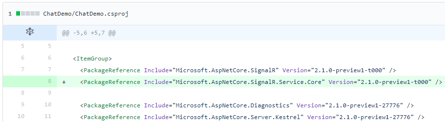

# Getting Started with Azure SignalR Service

[SignalR](https://www.asp.net/signalr) is an open source library for ASP.NET developers that simplifies the process of adding real-time web functionality to applications. With SignalR, you can easily create real-time web applications like web chat room, web games, etc.

One technical difficulty when using SignalR is SignalR runtime is running inside your ASP.NET application, so you'll need to handle the complexity of managing SignalR connections. For example, if your application has many concurrent connections, you may need to scale your application using [backplane](https://docs.microsoft.com/en-us/aspnet/signalr/overview/performance/scaleout-in-signalr) and network load balancers, even though your application code doesn't really need to scale.

This is where Azure SignalR Service can help. With Azure SignalR Service, you can leave SignalR and connection management logic to the service and focus on your own business logic.

In this article, you'll learn how to use Azure SignalR Service to create a real-time web application.

> Azure SignalR Service is built on [SignalR for ASP.NET Core](https://github.com/aspnet/SignalR) (which has some differences from ASP.NET SignalR). So you'll need to switch to SignalR Core in order to use this service.

## Build a Web Chat Room using SignalR
First let's create a web chat room using SignalR Core. To use SignalR Core, you need to first download and install [.NET Core SDK](https://www.microsoft.com/net/learn/get-started).

Build and run the chat room same at [ChatDemo](ChatDemo) folder:
1. Checkout local branch:
   ```
   git checkout local
   ```
2. Build chat room app:
   ```
   cd ChatDemo
   dotnet build
   ```
3. Run chat room app:
   ```
   dotnet run
   ```

Now you can open http://localhost:5050 in browser.

First time you open the chat room you'll be asked for you name:


Then type something in the text box and press enter, your message will be sent to everyone in the room:


Open multiple browser windows, then each one can talk to each other.

## A Brief Explanation

Here is a brief explanation of how this chat room application works.

One core concept in SignalR is Hub. Hub is a programming model that allows server and client talk to each other by calling methods. Here a hub defined in [Chat.cs](ChatDemo/Chat.cs):
```csharp
public class Chat : Hub
{
    public void broadcastMessage(string name, string message)
    {
        Clients.All.InvokeAsync("broadcastMessage", name, message);
    }
}
```

By defining this hub, server exposes a `broadcastMessage` method that can directly called by client (in [index.html](ChatDemo/wwwroot/index.html), when user clicks send button):
```js
document.getElementById('sendmessage').addEventListener('click', function (event) {
  // Call the broadcastMessage method on the hub.
  connection.invoke('broadcastMessage', name, messageInput.value);
  ...
});
```

Also inside a hub, server can call methods that are defined in client directly. In this sample, it calls a `broadcastMessage` method that displays the message to the chat window:
```js
var messageCallback = function (name, message) {
  // Html encode display name and message.
  var encodedName = name;
  var encodedMsg = message;
  // Add the message to the page.
  var liElement = document.createElement('li');
  liElement.innerHTML = '<strong>' + encodedName + '</strong>:&nbsp;&nbsp;' + encodedMsg;
  var messageBox = document.getElementById('messages');
  messageBox.appendChild(liElement);
  messageBox.scrollTop = messageBox.scrollHeight;
};
connection.on('broadcastMessage', messageCallback);
```

After you have the server and client logic, there is a few lines of code needed to start the SignalR server and connect it with client.

At server side, you need to call `AddSignalR` to initialize your SignalR server and map your hub to a server url (/chat):
```cs
public void ConfigureServices(IServiceCollection services)
{
    ...
    services.AddSignalR();
}

public void Configure(IApplicationBuilder app, IHostingEnvironment env)
{
    ...
    app.UseSignalR(routes =>
    {
        routes.MapHub<Chat>("chat");
    });
}
```

At client side, create a HubConnection that connects to the chat endpoint:
```js
var connection = new signalR.HubConnection(url, { transport: transport, uid: name });
...
return connection.start();
```

> This sample is based on the chat sample in SignalR official documentation, see this [article](https://docs.microsoft.com/en-us/aspnet/signalr/overview/getting-started/tutorial-getting-started-with-signalr-and-mvc) for more information of this sample.

## Use Azure SignalR Service in Web Chat Room
The sample above is a traditional SignalR application, where SignalR runtime and business logic runs inside the same ASP.NET web application. Now let's use Azure SignalR Service to replace the SignalR runtime in your application.

### Create an Azure SignalR Service

First let's create a SignalR service on Azure.

1. Open Azure portal, click "Create a resource" and find "SignalR Service (preview)".

   

2. Click "Create", and then fill necessary information, including resource name, resource group and location.

   

   Resource name will also be used as the DNS name of your service point. So you'll get a `<resource_name>.<location>.cloudapp.azure.com` that you can connect to.

3. Click "Create", your SignalR service will be created in a few minutes.

   

After your service is ready, let's go to the resource and see which properties it has.


1. DNS and public IP, this is the public address of the service. Azure SignalR Service uses 5001 port, you can use `<DNS>:5001` (also shown as host name) to connect to the service.

2. Primary key and secondary key. This is the key you can use to authenticate with the service. When using SignalR service, your application server authenticates with service using this access keys. Clients will authenticate with service using a different way (JWT, will be discussed later in this article).

### Update Web Chat Room to use Azure SignalR Service

Now let's update the chat room sample to use Azure SignalR Service.

The code is already at master branch, checkout this branch (`git checkout master`) and let's see what're the differences.

1. First, you need to add the service endpoint as a configuration entry.

   

   Update the endpoint and key with the ones of your SignalR service.

2. Then in [Startup.cs](ChatDemo/Startup.cs), instead of calling `AddSignalR` and `UseSignalR`, you need to call `AddSignalRService` and `UseSignalRService` and pass in the service endpoint to make the application connect the service instead of hosting SignalR on its own.

   

3. In client ([index.html](ChatDemo/index.html)), use `ServiceConnection` instead of `HubConnection`, which will automatically get service endpoint from application server and connect to the hub.

   

4. Finally, you need to reference a new package (`Microsoft.AspNetCore.SignalR.Service.Core`) where `AddSignalRService` and `UseSignalRService` are implemented.

   

Other than these changes, everything else remains the same, you can still use the hub interface you're already familiar with to write business logic.

Now let's build and run the app, you can see the app runs as usual, but instead of hosting a SignalR runtime by itself, it connects to the SignalR service running on Azure.


### Monitor Your SignalR Service

One benefit that comes with Azure SignalR Service is you'll have the ability to monitor your service status.

Go to your resource, open Monitoring Panel, click "Go to the Monitoring Dashboard", it will bring you to the service monitoring dashboard.


You can see some useful information in the monitoring dashboard, including the connection count, message count, connection rate and message rate. These data are almost real-time (refresh in 10 seconds) so you can know the status of your service in real time.

## Details Explained

TO BE ADDED

### Architecture

### Authentication

## Deploy Your Chat Room to Azure

Next step is to deploy your chat room app to an Azure Web App so you don't need to host it by yourself.

1. Azure Web App supports Docker container, first build the chat room app into a container.
   ```
   docker build -t chatdemo .
   ```
   To test the container locally:
   ```
   docker run -p 5050:5050 chatdemo
   ```
   Then you can use http://localhost:5050 to access the chat room.

2. Push the docker image to a container registry (this sample uses Azure Container Registry, you can also use other registries like DockerHub):
   ```
   docker login <acr_name>.azurecr.io
   docker tag chatdemo <acr_name>.azurecr.io/chatdemo
   docker push <acr_name>.azurecr.io/chatdemo
   ```

3. Next let's deploy the docker image to Web App.
   > This article uses [Azure CLI](https://docs.microsoft.com/en-us/cli/azure/install-azure-cli?view=azure-cli-latest) to deploy to Azure, you can also use other tools (like Visual Studio) to do the deployment.

   First create an Azure Web App.
   ```
   az group create --name <resource_group_name> --location "West US"
   az appservice plan create --name <app_service_plan_name> --resource-group <resource_group_name> --sku S1 --is-linux
   az webapp create --resource-group <resource_group_name> --plan <app_service_plan_name> --name <app_name>
   ```

   Then deploy the docker image to the web app:
   ```
   az webapp config container set
      --resource-group <resource_group_name> --name <app_name>
      --docker-custom-image-name <acr_name>.azurecr.io/chatdemo
      --docker-registry-server-url https://<acr_name>.azurecr.io
      --docker-registry-server-user <acr_name>
      --docker-registry-server-password <acr_password>
   az webapp config appsettings set --resource-group <resource_group_name> --name <app_name> --setting PORT=5050
   ```

   Now access the web app (`http://<app_name>.azurewebsites.net`) you'll see your chat room running in cloud.
